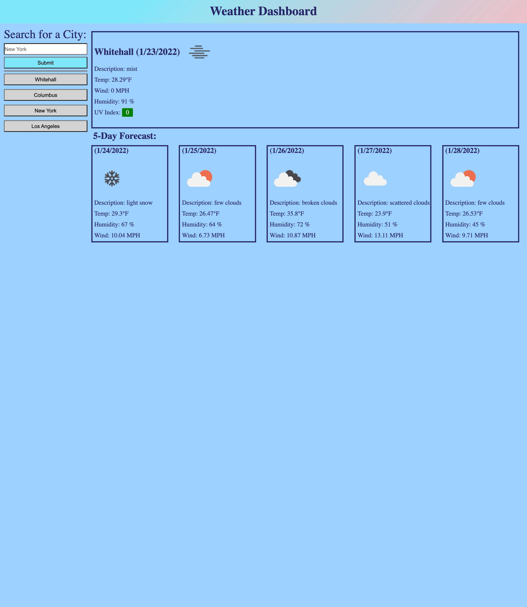

# Weather Dashboard

## Purpose
To create a web application which allows users to look up a city in the United States and view current and future weather forcast. 

## How To Use
Simply enter a US based city into the search bar and hit submit. The current weather and the future forcast will then display. Your search is then added to the search history. The search history keeps your ten most recent searches. Previously searched cities that are already displayed in your recent searches will not show more than once. 

## Built With
* HTML
* CSS
* JavaScript
* Openweather One Call API: https://openweathermap.org/api/one-call-api
* Openweather Gocoding API: https://openweathermap.org/api/geocoding-api

## Website 
https://omcewan.github.io/omcewan-weather-dashboard/

## Screenshot

## Contribution
Made with ❤️ by Orlando McEwan

